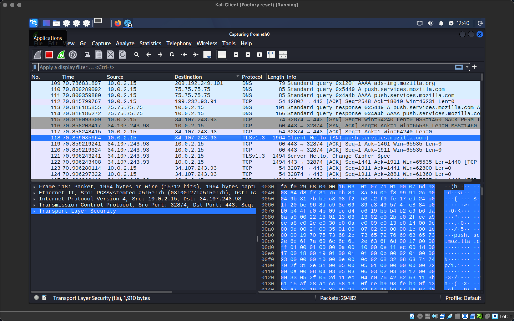

# 🦈 Wireshark Network Analysis Lab

---

# 📌 Overview

This project documents my hands-on practice analyzing network traffic using Wireshark.

The purpose of this lab is to develop skills used in Security Operations Center (SOC) environments, including packet analysis, protocol investigation, and identifying suspicious network activity.

---

# Lab Environment

## Tools Used

- Wireshark
- VirtualBox
- Windows/Linux Virtual Machines

---

# Analysis Skills Practiced

## Packet Capture Analysis

Investigated:

- Network conversations
- Source and destination addresses
- Communication patterns
- Protocol behavior

---

## Protocol Analysis

Analyzed:

- TCP
- UDP
- DNS
- HTTP
- ICMP
- ARP

---

## Network Troubleshooting

Used Wireshark to identify:

- Connectivity issues
- Failed connections
- Packet retransmissions
- Network behavior

---

# Lab Exercises

## DNS Investigation

Reviewed DNS queries and responses to understand:

- Domain lookups
- DNS request flow
- Client/server communication

## TCP Analysis

Analyzed:

- Three-way handshake
- TCP flags
- Connection states
- Retransmissions

## ICMP Troubleshooting

Investigated:

- Ping requests
- Echo replies
- Connectivity testing

---

# Security Concepts

Skills demonstrated:

- Network visibility
- Traffic monitoring
- Packet inspection
- Protocol understanding
- Basic threat analysis

---

# Screenshots

## 1. Packet Filtering

Applied Wireshark display filters to isolate relevant network traffic and remove unrelated packets. This technique improves the efficiency of packet analysis by focusing on specific protocols or conversations during an investigation.

---

## 2. Follow HTTP Stream

Used the **Follow HTTP Stream** feature to reconstruct an HTTP conversation between a client and server. This demonstrates how web requests and responses can be analyzed to better understand application-layer communications.

---

## 3. HTTP Port 80 Analysis

Examined HTTP traffic on TCP port 80 to identify request and response behavior. This exercise reinforced how unencrypted web traffic can be inspected for troubleshooting and analysis purposes.

---

## 4. Coloring Rules and TCP Flags

Explored Wireshark's coloring rules and TCP flags to quickly identify packet types and connection states. Understanding these visual indicators helps analysts recognize normal traffic patterns and investigate potential network issues.

---

## 5. ICMP Connectivity Test

Captured ICMP Echo Request and Echo Reply packets while performing a `ping` test to Google. This exercise demonstrated basic network connectivity testing and packet-level analysis of ICMP traffic.

---

# Future Improvements

- Analyze malware traffic samples
- Add PCAP investigation reports
- Practice SOC alert investigations
- Integrate with SIEM tools
